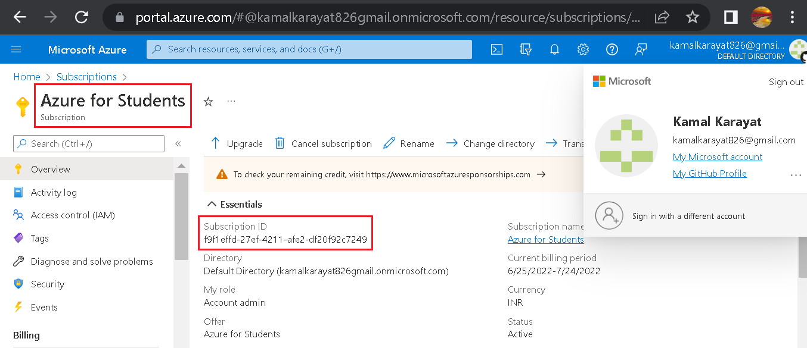
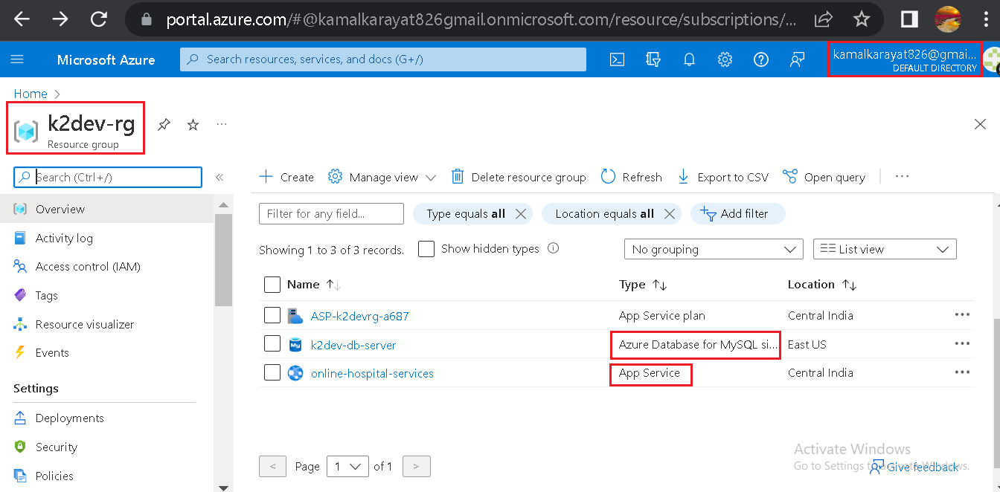
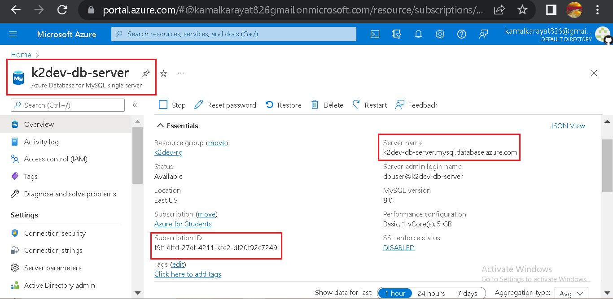
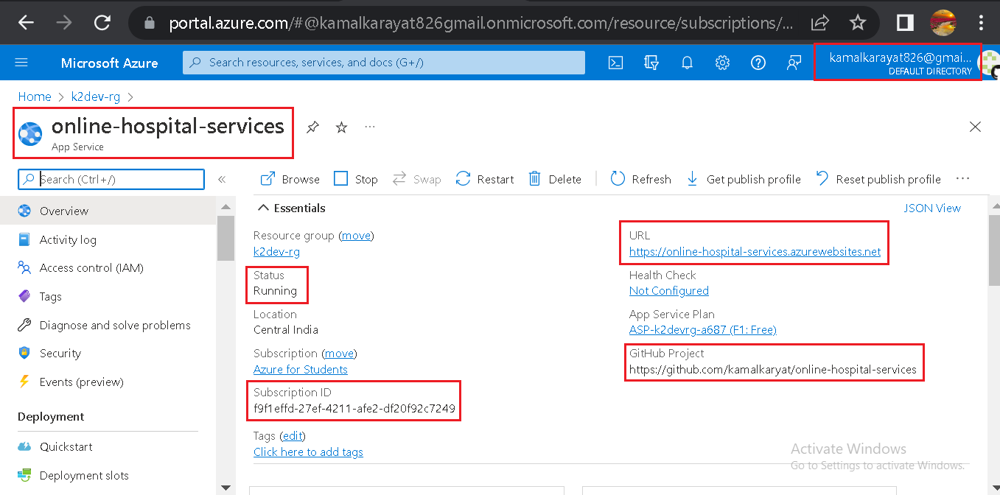
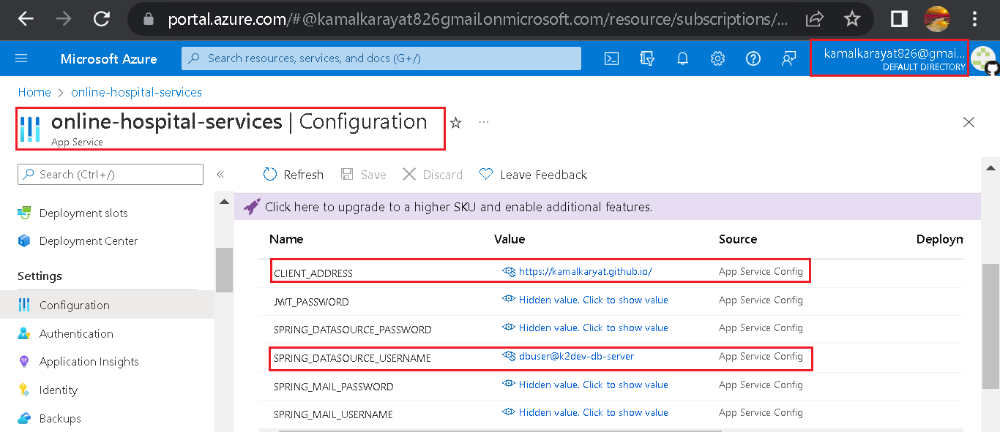
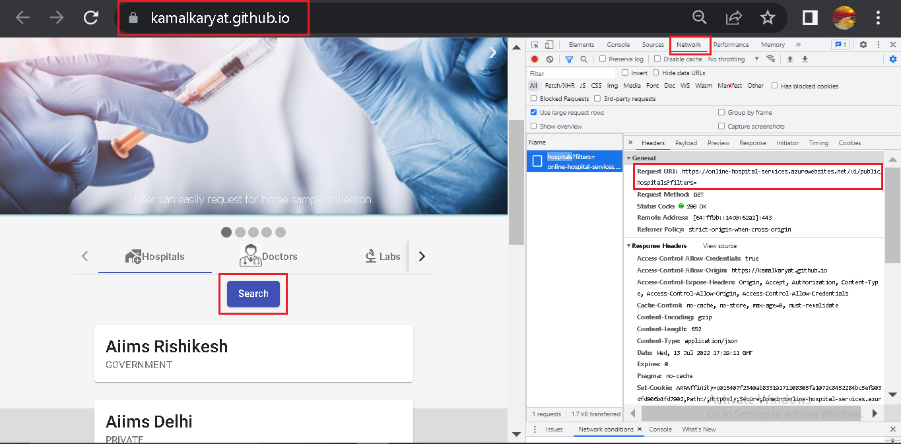
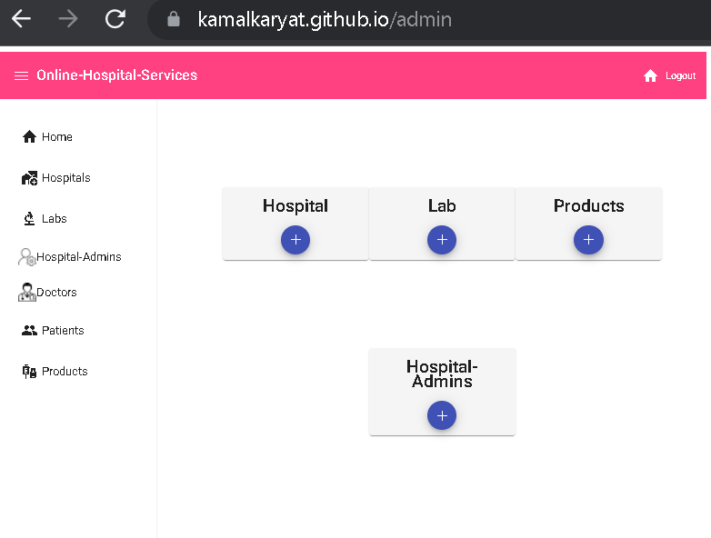
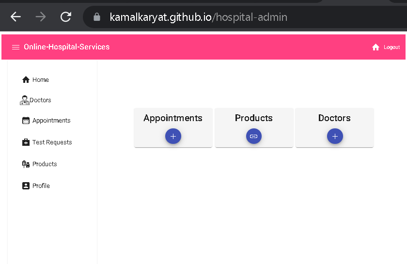
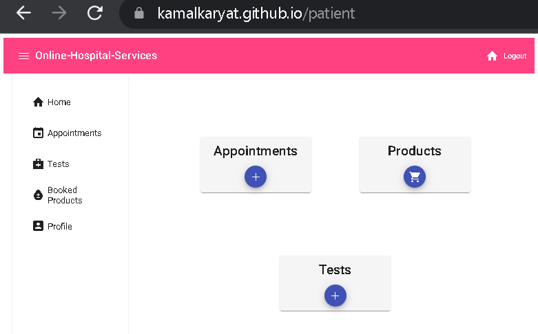

# online-hospital-services
Provides online hospital related services to its end users e.g. searching doctors, hospitals, blood, injection. Request for home tests. Scheduling appointments

## Demo
https://user-images.githubusercontent.com/77448427/179035743-b7d83527-ea76-45df-9ac8-566af2767f79.mp4

## Azure Screenshots

### Resource Group

### Azure Database for MySQL(Database)
- Server Name: k2dev-db-server.mysql.database.azure.com
- This Azure service is used in hosting & storing our mysql database i.e. ksk(database name)

### WebApp(Compute)
- App Service Name: online-hospital-services
- This Azure service is used for hosting SpringBoot backend application on Azure
- Client will access it via REST API calls.
- The SpringBoot application is deployed as a single jar which contains the embeded tomcat server
- WebApp specification:
  - Runtime Stack: Java 8
  - Java Web Server Stack: Java SE(Embedded Web Server)
  - Operating System: Windows
  - Region: Central India
  - Publish: Code
- Github Action is used for CI/CD pipeline

### Website Home Page

### Backend APIs
- Some unprotected apis are: 
  - Hospitals: (https://online-hospital-services.azurewebsites.net/v1/public/hospitals?filters=none)
  - Doctors: (https://online-hospital-services.azurewebsites.net/v1/public/doctors?filters=none)
  - Labs: (https://online-hospital-services.azurewebsites.net/v1/public/labs?filters=none)
  - Products: (https://online-hospital-services.azurewebsites.net/v1/public/products?filters=none)

## Admin Dashboard

## Hospital-Admin Dashboard

## Patient Dashboard

## Username & Passwords
- Admin
  - username: admin@hs.com
  - password: 12345@Aa
- Hospital-Admin
  - username: ha111@gmail.com
  - password: 12345@Aa
- Patient
  - username: p123@gmail.com
  - password: 12345@Aa
  ## Developed Using
  - Angular
  - SpringBoot
  - MySql 

  ## Angular Frontend Repository
  - [Online-Hospital-Services-Frontend](https://github.com/kamalkaryat/online-hospital-services-frontend)
  
  ## Deployment
  - SpringBoot backend application on Azure as App Service

  - Angular frontend application on Github Pages
  - [Website](https://kamalkaryat.github.io/)
  
  
  ## Security
  - Spring Security
  - JWT

  ## Type of Roles:
  1. User/Patient
  2. Hospital-Admin
  3. Doctor
  4. Admin
  
  ## Patient[or User] 
  - Register with this platform
  - Search for hospitals, doctors, labs, products(such as blood, tests, injections, etc)
  - Book, cancel & reschedule appointments in any hospital which are registered  with this platform.
  - Book products, so that later they can purchase them from the corresponding hospitals
  - Request for a home tests if possible.
  - Manage his/her profile
  
  ## Hospital-Admin
  - Add and remove doctors
  - Add & remove appointments from their hospital
  - Can link a product with this platform for online services
  - Remove linked products from this platform
  - Can Update products stock of their hospital
  - Accept or reject users test requests
  - Upload patient's[user's] test report. This feature will be available in future updates.
 
  ## Admin
  - Manage Hospitals
  - Manage Labs
  - Manage Doctors
  - Manage Patients[or Users]
  - Manage Hospital-Admins
  - Manage Products
  
  ## Registration Process
  - Patients/Users can simply use signup form for their registration
  - Admin will register Hospital-Admins  
  - Hospital-Admin will register Doctors
